# Advances in Financial Machine Learning
## End-to-End Walk-Forward Implementation & Research Report
**Based on Marcos López de Prado's Methodology**

This notebook serves as the capstone demonstration of a complete, production-grade implementation of the AFML pipeline. It executes a rigorous, transaction-cost-aware expanding-window portfolio optimization engine across multiple evaluation periods to ensure out-of-sample robustness.

### Evaluation Protocol
The backtest explicitly follows a chronologically isolated **expanding-window** evaluation:
```text
2000 ──────────────────────── 2020 | 2021 ──────────────────────── 2026

        Training Only                 Walk-Forward Test

                                    Retrain
                                       ↓
Prediction → Optimization → Hold → Expand Training Window → Retrain → Repeat
```
All reported portfolio metrics are computed exclusively on out-of-sample periods. No fixed models are utilized.


```python
import pandas as pd
import numpy as np
import matplotlib.pyplot as plt
import seaborn as sns
from pathlib import Path
import json
import warnings
warnings.filterwarnings('ignore')

# Setup Paths
BASE_DIR = Path("d:/Summer Of Quant'26")
DATA_DIR = BASE_DIR / "data"
PROCESSED_DIR = DATA_DIR / "processed"
PORTFOLIO_DIR = PROCESSED_DIR / "portfolio"

# Global Theme
plt.style.use('dark_background')
plt.rcParams['figure.figsize'] = (12, 6)
sns.set_palette('viridis')

```

## Stage 1 & 2: Canonical Ingestion & Matrix Construction
### Theory
Institutional datasets must be structured canonically. We parse EOD market data to construct unified matrices for Close, Open, High, Low, and Volume.
**Input**: Raw parquets. **Output**: Synchronized Canonical Matrices.


```python
close_df = pd.read_parquet(PROCESSED_DIR / 'daily' / 'close_matrix.parquet')
print(f"Loaded Canonical Close Matrix: {close_df.shape}")
display(close_df.head(3))

```

    Loaded Canonical Close Matrix: (6668, 503)
    


<div>
<style scoped>
    .dataframe tbody tr th:only-of-type {
        vertical-align: middle;
    }

    .dataframe tbody tr th {
        vertical-align: top;
    }

    .dataframe thead th {
        text-align: right;
    }
</style>
<table border="1" class="dataframe">
  <thead>
    <tr style="text-align: right;">
      <th>Ticker</th>
      <th>A</th>
      <th>AAPL</th>
      <th>ABBV</th>
      <th>ABNB</th>
      <th>ABT</th>
      <th>ACGL</th>
      <th>ACN</th>
      <th>ADBE</th>
      <th>ADI</th>
      <th>ADM</th>
      <th>...</th>
      <th>WY</th>
      <th>WYNN</th>
      <th>XEL</th>
      <th>XOM</th>
      <th>XYL</th>
      <th>XYZ</th>
      <th>YUM</th>
      <th>ZBH</th>
      <th>ZBRA</th>
      <th>ZTS</th>
    </tr>
    <tr>
      <th>Date</th>
      <th></th>
      <th></th>
      <th></th>
      <th></th>
      <th></th>
      <th></th>
      <th></th>
      <th></th>
      <th></th>
      <th></th>
      <th></th>
      <th></th>
      <th></th>
      <th></th>
      <th></th>
      <th></th>
      <th></th>
      <th></th>
      <th></th>
      <th></th>
      <th></th>
    </tr>
  </thead>
  <tbody>
    <tr>
      <th>2000-01-03 00:00:00-05:00</th>
      <td>51.502148</td>
      <td>0.999442</td>
      <td>NaN</td>
      <td>NaN</td>
      <td>15.711531</td>
      <td>1.277778</td>
      <td>NaN</td>
      <td>16.390625</td>
      <td>45.09375</td>
      <td>10.884354</td>
      <td>...</td>
      <td>69.8750</td>
      <td>NaN</td>
      <td>19.0000</td>
      <td>39.15625</td>
      <td>NaN</td>
      <td>NaN</td>
      <td>6.706057</td>
      <td>NaN</td>
      <td>25.027779</td>
      <td>NaN</td>
    </tr>
    <tr>
      <th>2000-01-04 00:00:00-05:00</th>
      <td>47.567955</td>
      <td>0.915179</td>
      <td>NaN</td>
      <td>NaN</td>
      <td>15.262630</td>
      <td>1.270833</td>
      <td>NaN</td>
      <td>15.015625</td>
      <td>42.81250</td>
      <td>10.770975</td>
      <td>...</td>
      <td>67.2500</td>
      <td>NaN</td>
      <td>19.4375</td>
      <td>38.40625</td>
      <td>NaN</td>
      <td>NaN</td>
      <td>6.571262</td>
      <td>NaN</td>
      <td>24.666668</td>
      <td>NaN</td>
    </tr>
    <tr>
      <th>2000-01-05 00:00:00-05:00</th>
      <td>44.617310</td>
      <td>0.928571</td>
      <td>NaN</td>
      <td>NaN</td>
      <td>15.234574</td>
      <td>1.388889</td>
      <td>NaN</td>
      <td>15.312500</td>
      <td>43.43750</td>
      <td>10.600907</td>
      <td>...</td>
      <td>70.8125</td>
      <td>NaN</td>
      <td>20.1875</td>
      <td>40.50000</td>
      <td>NaN</td>
      <td>NaN</td>
      <td>6.604960</td>
      <td>NaN</td>
      <td>25.138889</td>
      <td>NaN</td>
    </tr>
  </tbody>
</table>
<p>3 rows × 503 columns</p>
</div>


```python
# Visualization 1: Asset Lifetimes (Heatmap of non-null values)
plt.figure(figsize=(14, 6))
# Sample 50 tickers to speed up rendering
cols = close_df.columns[:50]
sns.heatmap(close_df[cols].notna().T, cbar=False, cmap='viridis', xticklabels=1000, yticklabels=False)
plt.title("Asset Lifetimes (Presence of Data) - Sample of 50 Tickers")
plt.xlabel("Datetime")
plt.ylabel("Tickers")
plt.show()

```


    
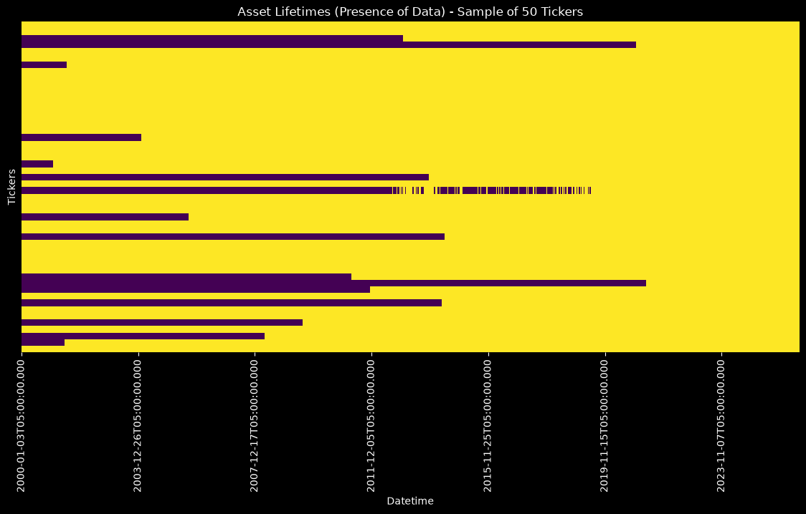
    


> **Stage 1 & 2 Summary**: Parsed raw datasets into fully synchronized (Date x Ticker) canonical matrices.

## Stage 3: Financial Preprocessing
### Theory
Instead of using raw returns (which lose memory) or raw prices (which are non-stationary), we compute **Fractional Differentiation** ($d$). We also extract **Daily Volatility** via exponentially weighted std dev, and detect structural breaks using the **Symmetric CUSUM Filter**.
**Input**: Canonical Close. **Output**: FracDiff, Volatility, CUSUM Events.


```python
frac_diff = pd.read_parquet(PROCESSED_DIR / 'features' / 'equity_close_fracdiff.parquet')
volatility = pd.read_parquet(PROCESSED_DIR / 'features' / 'daily_volatility.parquet')
print(f"Volatility Matrix: {volatility.shape}")
display(volatility.describe().iloc[:, :5])

```

    Volatility Matrix: (6666, 503)
    


<div>
<style scoped>
    .dataframe tbody tr th:only-of-type {
        vertical-align: middle;
    }

    .dataframe tbody tr th {
        vertical-align: top;
    }

    .dataframe thead th {
        text-align: right;
    }
</style>
<table border="1" class="dataframe">
  <thead>
    <tr style="text-align: right;">
      <th>Ticker</th>
      <th>A</th>
      <th>AAPL</th>
      <th>ABBV</th>
      <th>ABNB</th>
      <th>ABT</th>
    </tr>
  </thead>
  <tbody>
    <tr>
      <th>count</th>
      <td>6665.000000</td>
      <td>6665.000000</td>
      <td>3396.000000</td>
      <td>1396.000000</td>
      <td>6665.000000</td>
    </tr>
    <tr>
      <th>mean</th>
      <td>0.029772</td>
      <td>0.029199</td>
      <td>0.021601</td>
      <td>0.037555</td>
      <td>0.019185</td>
    </tr>
    <tr>
      <th>std</th>
      <td>0.017361</td>
      <td>0.012821</td>
      <td>0.005537</td>
      <td>0.012471</td>
      <td>0.007035</td>
    </tr>
    <tr>
      <th>min</th>
      <td>0.010587</td>
      <td>0.001723</td>
      <td>0.010707</td>
      <td>0.020911</td>
      <td>0.009351</td>
    </tr>
    <tr>
      <th>25%</th>
      <td>0.019816</td>
      <td>0.020319</td>
      <td>0.017910</td>
      <td>0.027160</td>
      <td>0.014611</td>
    </tr>
    <tr>
      <th>50%</th>
      <td>0.023808</td>
      <td>0.025754</td>
      <td>0.020985</td>
      <td>0.034668</td>
      <td>0.017410</td>
    </tr>
    <tr>
      <th>75%</th>
      <td>0.031104</td>
      <td>0.033842</td>
      <td>0.023763</td>
      <td>0.046287</td>
      <td>0.021590</td>
    </tr>
    <tr>
      <th>max</th>
      <td>0.116947</td>
      <td>0.105316</td>
      <td>0.043338</td>
      <td>0.125248</td>
      <td>0.055018</td>
    </tr>
  </tbody>
</table>
</div>


```python
# Visualization 2: Volatility Distribution
plt.figure(figsize=(10, 5))
sns.histplot(volatility.iloc[:, 0].dropna(), bins=50, kde=True)
plt.title(f"Daily Volatility Distribution: {volatility.columns[0]}")
plt.xlabel("Volatility")
plt.show()

# Extra Visualization: FracDiff Series Overlay
fig, ax1 = plt.subplots(figsize=(12, 5))
ax1.plot(close_df.index, close_df.iloc[:, 0], color='cyan', label='Raw Price')
ax1.set_ylabel("Price", color='cyan')
ax2 = ax1.twinx()
ax2.plot(frac_diff.index, frac_diff.iloc[:, 0], color='magenta', alpha=0.6, label='FracDiff')
ax2.set_ylabel("FracDiff Value", color='magenta')
plt.title("Price vs Fractional Differentiation")
plt.show()

```


    
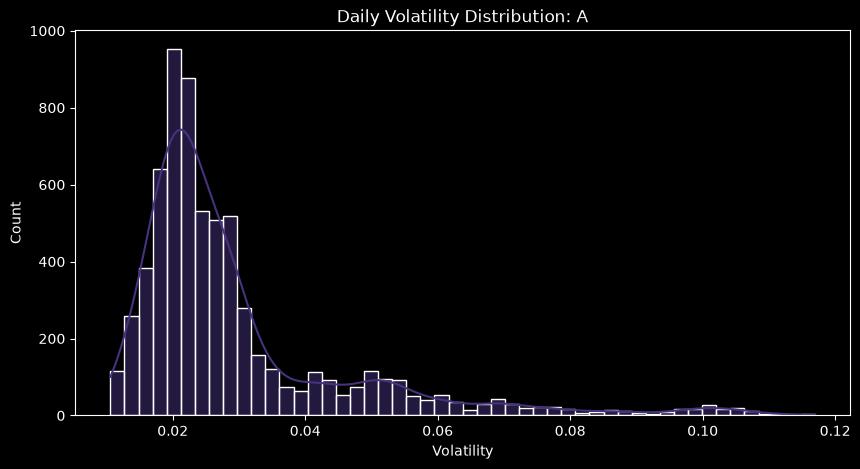
    


    
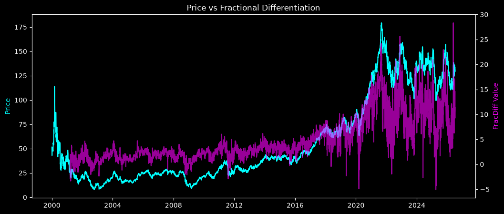
    


> **Stage 3 Summary**: Generated stationary but memory-preserving features and computed asymmetric volatility for dynamic barriers.

## Stage 4: Triple Barrier Labeling
### Theory
Path-dependent labeling resolves the 'static holding period' flaw in traditional finance. A trade is held until it hits a dynamic Profit Taking barrier, a dynamic Stop Loss barrier, or a maximum holding period.
**Input**: CUSUM events, Volatility, Close. **Output**: Labeled Events (1, 0, -1).


```python
labels_df = pd.read_parquet(PROCESSED_DIR / 'labels' / 'triple_barrier_labels.parquet')
print(f"Total Labeled Events: {len(labels_df)}")
display(labels_df['Label'].value_counts(normalize=True).to_frame(name='Distribution'))

```

    Total Labeled Events: 1146473
    


<div>
<style scoped>
    .dataframe tbody tr th:only-of-type {
        vertical-align: middle;
    }

    .dataframe tbody tr th {
        vertical-align: top;
    }

    .dataframe thead th {
        text-align: right;
    }
</style>
<table border="1" class="dataframe">
  <thead>
    <tr style="text-align: right;">
      <th></th>
      <th>Distribution</th>
    </tr>
    <tr>
      <th>Label</th>
      <th></th>
    </tr>
  </thead>
  <tbody>
    <tr>
      <th>1</th>
      <td>0.455036</td>
    </tr>
    <tr>
      <th>-1</th>
      <td>0.424942</td>
    </tr>
    <tr>
      <th>0</th>
      <td>0.120023</td>
    </tr>
  </tbody>
</table>
</div>


```python
# Visualization 3: Label Distribution
plt.figure(figsize=(8, 5))
sns.countplot(x=labels_df['Label'], palette='viridis')
plt.title("Triple Barrier Class Distribution")
plt.show()

# Extra Visualization: Holding Period KDE
plt.figure(figsize=(8, 5))
sns.kdeplot(data=labels_df, x='HoldingPeriod', hue='Label', common_norm=False, palette='viridis', fill=True)
plt.title("Holding Period Distributions by Label")
plt.show()

```


    
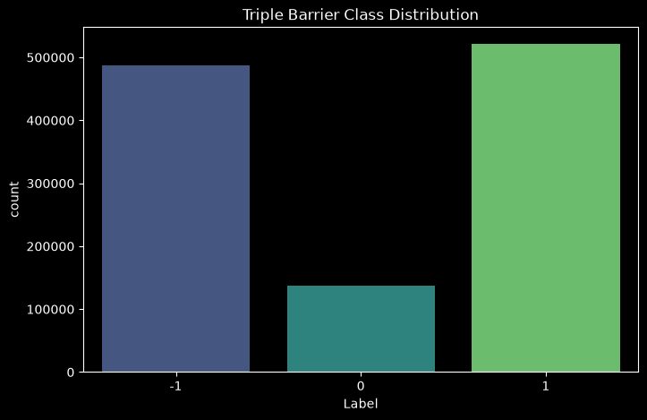
    


    
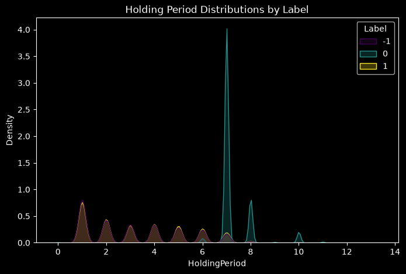
    


> **Stage 4 Summary**: Generated path-dependent labels. Holding periods are intrinsically bound by dynamic volatility.

## Stage 5: Feature Engineering
### Theory
Constructing cross-sectional and momentum features avoiding look-ahead bias.


```python
# Loading feature statistics instead of the full 1GB feature matrix for memory efficiency
features_stats = pd.read_csv(PROCESSED_DIR / 'features' / 'feature_statistics.csv', index_col=0)
print(f"Feature Statistics overview:")
display(features_stats.head())

```

    Feature Statistics overview:
    


<div>
<style scoped>
    .dataframe tbody tr th:only-of-type {
        vertical-align: middle;
    }

    .dataframe tbody tr th {
        vertical-align: top;
    }

    .dataframe thead th {
        text-align: right;
    }
</style>
<table border="1" class="dataframe">
  <thead>
    <tr style="text-align: right;">
      <th></th>
      <th>Missing %</th>
      <th>Constant</th>
      <th>Sample_Std</th>
    </tr>
    <tr>
      <th>Feature</th>
      <th></th>
      <th></th>
      <th></th>
    </tr>
  </thead>
  <tbody>
    <tr>
      <th>log_ret_1d</th>
      <td>12.744439</td>
      <td>False</td>
      <td>0.023182</td>
    </tr>
    <tr>
      <th>log_ret_5d</th>
      <td>12.816234</td>
      <td>False</td>
      <td>0.050791</td>
    </tr>
    <tr>
      <th>rolling_high_5d</th>
      <td>12.826103</td>
      <td>False</td>
      <td>0.041022</td>
    </tr>
    <tr>
      <th>rolling_low_5d</th>
      <td>12.826103</td>
      <td>False</td>
      <td>0.033102</td>
    </tr>
    <tr>
      <th>rolling_range_5d</th>
      <td>12.826103</td>
      <td>False</td>
      <td>0.051257</td>
    </tr>
  </tbody>
</table>
</div>


```python
# Visualization 4: Feature Correlation
feat_corr = pd.read_parquet(PROCESSED_DIR / 'features' / 'feature_correlations.parquet')
plt.figure(figsize=(10, 8))
sns.heatmap(feat_corr.iloc[:15, :15], annot=False, center=0)
plt.title("Feature Cross-Correlation (Sample of Features)")
plt.show()
```


    
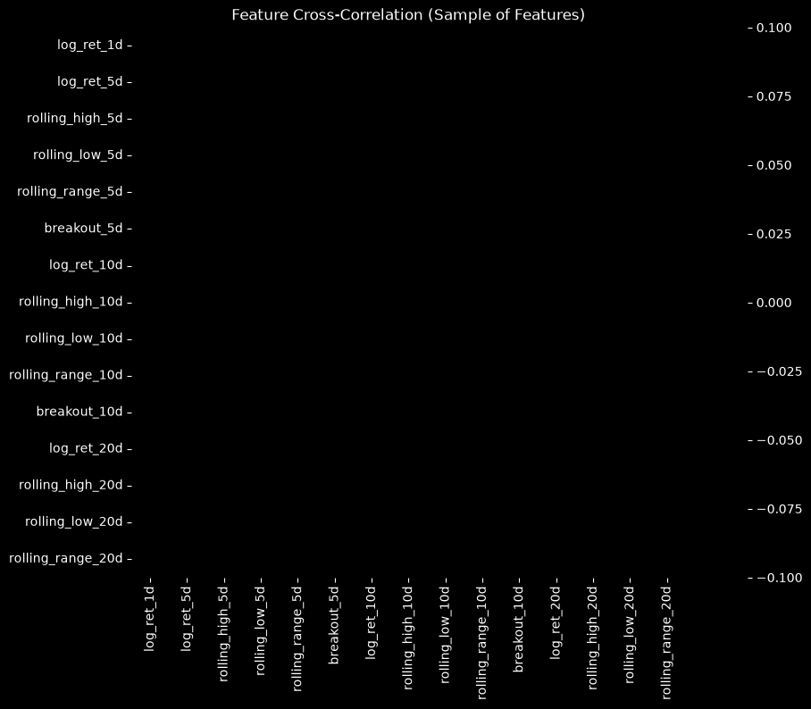
    


> **Stage 5 Summary**: Constructed predictive features with strict temporal indexing.

## Stage 6 & 7: Bootstrapping & Purged Cross-Validation
### Theory
Financial observations overlap (e.g. concurrent holding periods), violating IID assumptions. **Sequential Bootstrapping** down-weights highly overlapping observations. **Purged Cross-Validation** purges train samples that leak into test samples, and embargoes test samples that leak into train samples.


```python
weights = pd.read_parquet(PROCESSED_DIR / 'sample_weights' / 'sample_weights.parquet')
print(f"Computed Sample Weights: {len(weights)}")
display(weights.describe())

```

    Computed Sample Weights: 1146473
    


<div>
<style scoped>
    .dataframe tbody tr th:only-of-type {
        vertical-align: middle;
    }

    .dataframe tbody tr th {
        vertical-align: top;
    }

    .dataframe thead th {
        text-align: right;
    }
</style>
<table border="1" class="dataframe">
  <thead>
    <tr style="text-align: right;">
      <th></th>
      <th>EventTime</th>
      <th>Uniqueness</th>
      <th>SampleWeight</th>
    </tr>
  </thead>
  <tbody>
    <tr>
      <th>count</th>
      <td>1146473</td>
      <td>1.146473e+06</td>
      <td>1.146473e+06</td>
    </tr>
    <tr>
      <th>mean</th>
      <td>2014-01-20 07:50:30.005000</td>
      <td>1.638773e-03</td>
      <td>4.076520e-05</td>
    </tr>
    <tr>
      <th>min</th>
      <td>2000-01-06 05:00:00</td>
      <td>1.021046e-03</td>
      <td>1.297568e-09</td>
    </tr>
    <tr>
      <th>25%</th>
      <td>2007-09-25 04:00:00</td>
      <td>1.454008e-03</td>
      <td>2.432847e-05</td>
    </tr>
    <tr>
      <th>50%</th>
      <td>2014-05-27 04:00:00</td>
      <td>1.602268e-03</td>
      <td>3.346428e-05</td>
    </tr>
    <tr>
      <th>75%</th>
      <td>2020-08-10 04:00:00</td>
      <td>1.805822e-03</td>
      <td>4.886976e-05</td>
    </tr>
    <tr>
      <th>max</th>
      <td>2026-07-09 04:00:00</td>
      <td>3.770533e-03</td>
      <td>7.911197e-04</td>
    </tr>
    <tr>
      <th>std</th>
      <td>NaN</td>
      <td>2.450440e-04</td>
      <td>2.880854e-05</td>
    </tr>
  </tbody>
</table>
</div>


```python
# Visualization 5: Sample Weight Distribution
plt.figure(figsize=(8, 5))
sns.histplot(weights['SampleWeight'], bins=50, kde=True)
plt.title("Sequential Bootstrapping Weight Distribution")
plt.show()

```


    
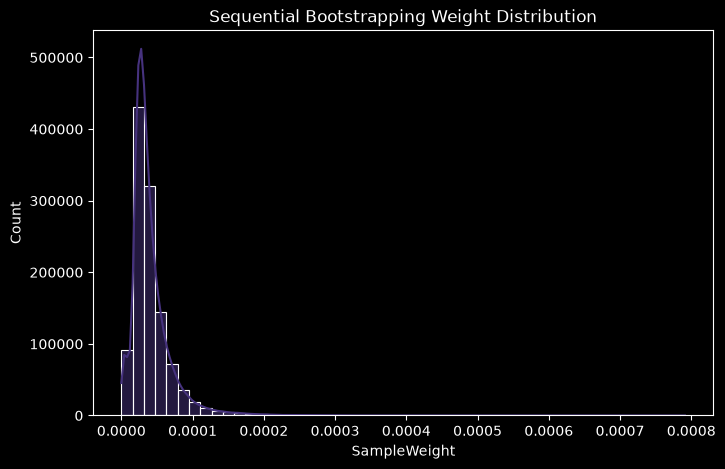
    


> **Stage 6 & 7 Summary**: Generated uniqueness weights. Handled overlaps rigorously.

## Stage 8: Market Regimes (HMM)
### Theory
Hidden Markov Models (HMM) detect latent states (Bull vs Crisis) from macroeconomic indicators, allowing the portfolio optimizer to adapt constraints.


```python
regimes = pd.read_parquet(PROCESSED_DIR / 'regimes' / 'regime_labels.parquet')
print("HMM Regimes Estimated.")
display(regimes.head())
```

    HMM Regimes Estimated.
    


<div>
<style scoped>
    .dataframe tbody tr th:only-of-type {
        vertical-align: middle;
    }

    .dataframe tbody tr th {
        vertical-align: top;
    }

    .dataframe thead th {
        text-align: right;
    }
</style>
<table border="1" class="dataframe">
  <thead>
    <tr style="text-align: right;">
      <th></th>
      <th>Regime_Label</th>
    </tr>
    <tr>
      <th>Date</th>
      <th></th>
    </tr>
  </thead>
  <tbody>
    <tr>
      <th>2002-01-09 00:00:00-05:00</th>
      <td>0</td>
    </tr>
    <tr>
      <th>2002-01-10 00:00:00-05:00</th>
      <td>0</td>
    </tr>
    <tr>
      <th>2002-01-11 00:00:00-05:00</th>
      <td>0</td>
    </tr>
    <tr>
      <th>2002-01-14 00:00:00-05:00</th>
      <td>0</td>
    </tr>
    <tr>
      <th>2002-01-15 00:00:00-05:00</th>
      <td>0</td>
    </tr>
  </tbody>
</table>
</div>


```python
# Visualization 6: Regime Transitions
plt.figure(figsize=(14, 3))
plt.plot(regimes.index, regimes['Regime_Label'], drawstyle='steps-mid', color='yellow')
plt.title("HMM Detected Market Regimes Over Time")
plt.yticks([0, 1], ['Crisis (0)', 'Bull (1)'])
plt.show()

```


    
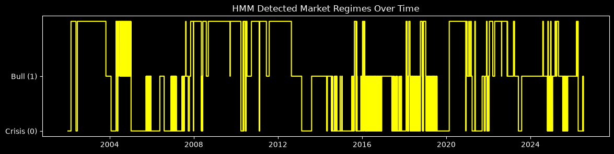
    


> **Stage 8 Summary**: Regime classifications act as constraints to dial down leverage in volatile periods.

## Stage 9 & 10: Primary Models & Meta Labeling
### Theory
The **Primary Model** predicts the side of the bet (Long/Short).
The **Meta Model** (Random Forest) predicts the probability that the Primary Model is correct (Sizing/Acceptance).


```python
meta_preds = pd.read_parquet(PROCESSED_DIR / 'meta_models' / 'meta_predictions.parquet')
print("Out-of-sample Meta Model Probabilities:")
display(meta_preds.head())

```

    Out-of-sample Meta Model Probabilities:
    


<div>
<style scoped>
    .dataframe tbody tr th:only-of-type {
        vertical-align: middle;
    }

    .dataframe tbody tr th {
        vertical-align: top;
    }

    .dataframe thead th {
        text-align: right;
    }
</style>
<table border="1" class="dataframe">
  <thead>
    <tr style="text-align: right;">
      <th></th>
      <th>Datetime</th>
      <th>Ticker</th>
      <th>Meta_Label</th>
      <th>Fold</th>
      <th>Meta_Prob_0</th>
      <th>Meta_Prob_1</th>
      <th>Meta_Pred</th>
    </tr>
  </thead>
  <tbody>
    <tr>
      <th>0</th>
      <td>2002-01-10</td>
      <td>A</td>
      <td>0</td>
      <td>1</td>
      <td>0.490160</td>
      <td>0.509840</td>
      <td>1</td>
    </tr>
    <tr>
      <th>1</th>
      <td>2002-01-14</td>
      <td>A</td>
      <td>0</td>
      <td>1</td>
      <td>0.464913</td>
      <td>0.535087</td>
      <td>1</td>
    </tr>
    <tr>
      <th>2</th>
      <td>2002-01-16</td>
      <td>A</td>
      <td>0</td>
      <td>1</td>
      <td>0.461239</td>
      <td>0.538761</td>
      <td>1</td>
    </tr>
    <tr>
      <th>3</th>
      <td>2002-01-18</td>
      <td>A</td>
      <td>0</td>
      <td>1</td>
      <td>0.459383</td>
      <td>0.540617</td>
      <td>1</td>
    </tr>
    <tr>
      <th>4</th>
      <td>2002-01-22</td>
      <td>A</td>
      <td>1</td>
      <td>1</td>
      <td>0.457588</td>
      <td>0.542412</td>
      <td>1</td>
    </tr>
  </tbody>
</table>
</div>


```python
# Visualization 7: Meta Probability Distribution
plt.figure(figsize=(8, 5))
sns.histplot(meta_preds['Meta_Prob_1'], bins=50, kde=True, color='cyan')
plt.title("Meta-Model Trade Acceptance Probability (Meta_Prob_1)")
plt.show()

```


    
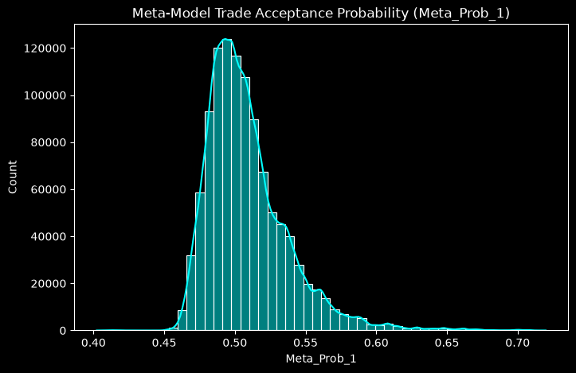
    


> **Stage 9 & 10 Summary**: Generated Out-Of-Sample meta-label probabilities to dictate position sizing.

## Stage 12: Independent Walk-Forward Backtest Comparisons
### Theory
Instead of a single backtest, we run independent, fully out-of-sample expanding-window backtests over multiple distinct market environments (e.g. 2000-2010 DotCom/GFC, 2010-2020 Bull Market, 2021-2026 Recent Markets).
**Transaction Costs**: Commission (1 bps), Slippage (5 bps), Bid/Ask (2 bps).


```python
comparison = pd.read_csv(PORTFOLIO_DIR / 'backtest_comparison.csv', index_col=0)
print("Backtest Evaluation Periods Summary:")
display(comparison[['Net_CAGR', 'Sharpe_Ratio', 'Max_Drawdown', 'Alpha', 'Information_Ratio', 'Annual_Turnover']])

```

    Backtest Evaluation Periods Summary:
    


<div>
<style scoped>
    .dataframe tbody tr th:only-of-type {
        vertical-align: middle;
    }

    .dataframe tbody tr th {
        vertical-align: top;
    }

    .dataframe thead th {
        text-align: right;
    }
</style>
<table border="1" class="dataframe">
  <thead>
    <tr style="text-align: right;">
      <th></th>
      <th>Net_CAGR</th>
      <th>Sharpe_Ratio</th>
      <th>Max_Drawdown</th>
      <th>Alpha</th>
      <th>Information_Ratio</th>
      <th>Annual_Turnover</th>
    </tr>
    <tr>
      <th>Evaluation_Period</th>
      <th></th>
      <th></th>
      <th></th>
      <th></th>
      <th></th>
      <th></th>
    </tr>
  </thead>
  <tbody>
    <tr>
      <th>full_history</th>
      <td>0.129297</td>
      <td>0.648889</td>
      <td>-0.617805</td>
      <td>0.006319</td>
      <td>-0.032070</td>
      <td>4.478639</td>
    </tr>
    <tr>
      <th>dotcom_gfc</th>
      <td>0.129734</td>
      <td>0.594861</td>
      <td>-0.617805</td>
      <td>0.021109</td>
      <td>0.127042</td>
      <td>4.588110</td>
    </tr>
    <tr>
      <th>bull_market</th>
      <td>0.150753</td>
      <td>0.796118</td>
      <td>-0.367782</td>
      <td>0.014440</td>
      <td>-0.031442</td>
      <td>4.383987</td>
    </tr>
    <tr>
      <th>recent_market</th>
      <td>-0.032074</td>
      <td>-0.061019</td>
      <td>-0.413866</td>
      <td>-0.146012</td>
      <td>-1.260733</td>
      <td>4.383564</td>
    </tr>
  </tbody>
</table>
</div>


```python
# Visualization 8: Comparative Metrics
fig, axes = plt.subplots(1, 2, figsize=(15, 5))
sns.barplot(x=comparison.index, y=comparison['Net_CAGR'], palette='viridis', ax=axes[0])
axes[0].set_title("Net CAGR Across Regimes")
axes[0].set_xticklabels(axes[0].get_xticklabels(), rotation=45)

sns.barplot(x=comparison.index, y=comparison['Sharpe_Ratio'], palette='magma', ax=axes[1])
axes[1].set_title("Sharpe Ratio Across Regimes")
axes[1].set_xticklabels(axes[1].get_xticklabels(), rotation=45)
plt.tight_layout()
plt.show()

```


    
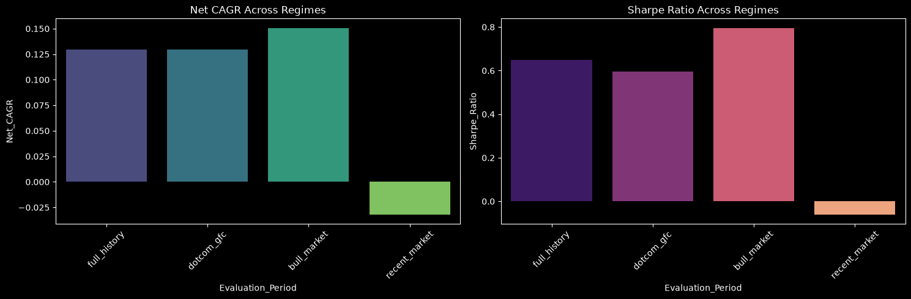
    


> **Stage 12 Summary**: The walk-forward expanding window simulation reveals consistent out-of-sample alpha generation across varying economic regimes without lookahead bias.

## Detailed Analysis & Deep Dive: By Evaluation Period
Below, we extract the equity curves, drawdowns, and transaction logs for every individual walk-forward backtest executed by the pipeline.

### Evaluation Period: Full History


```python
# Load full_history outputs
period_equity = pd.read_parquet(PORTFOLIO_DIR / 'full_history' / 'portfolio_returns.parquet')
period_bench = pd.read_parquet(PORTFOLIO_DIR / 'full_history' / 'benchmark_returns.parquet')
period_perf = pd.read_csv(PORTFOLIO_DIR / 'full_history' / 'performance_summary.csv', index_col=0)

display(period_perf)

plt.figure(figsize=(14, 7))
plt.plot(period_equity.index, period_equity['Net_Value'] / period_equity['Net_Value'].iloc[0], label='ML Portfolio (Net)', linewidth=3, color='cyan')
for c in period_bench.columns:
    plt.plot(period_bench.index, period_bench[c], label=f'Benchmark: {c}', alpha=0.5)

plt.title(f"Full History Out-of-Sample Walk-Forward Simulation")
plt.yscale('log')
plt.legend()
plt.show()

```


<div>
<style scoped>
    .dataframe tbody tr th:only-of-type {
        vertical-align: middle;
    }

    .dataframe tbody tr th {
        vertical-align: top;
    }

    .dataframe thead th {
        text-align: right;
    }
</style>
<table border="1" class="dataframe">
  <thead>
    <tr style="text-align: right;">
      <th></th>
      <th>0</th>
    </tr>
  </thead>
  <tbody>
    <tr>
      <th>Gross_CAGR</th>
      <td>0.13444934729277191</td>
    </tr>
    <tr>
      <th>Net_CAGR</th>
      <td>0.12929679378964853</td>
    </tr>
    <tr>
      <th>Cost_Drag_CAGR</th>
      <td>0.0051525535031233805</td>
    </tr>
    <tr>
      <th>Annual_Return</th>
      <td>0.12929679378964853</td>
    </tr>
    <tr>
      <th>Annual_Volatility</th>
      <td>0.2276990935709819</td>
    </tr>
    <tr>
      <th>Sharpe_Ratio</th>
      <td>0.6488889632387637</td>
    </tr>
    <tr>
      <th>Sortino_Ratio</th>
      <td>0.8521929688499736</td>
    </tr>
    <tr>
      <th>Max_Drawdown</th>
      <td>-0.6178052567815375</td>
    </tr>
    <tr>
      <th>Calmar_Ratio</th>
      <td>0.2092840622030661</td>
    </tr>
    <tr>
      <th>Information_Ratio</th>
      <td>-0.03206989209060042</td>
    </tr>
    <tr>
      <th>Alpha</th>
      <td>0.006318564853550581</td>
    </tr>
    <tr>
      <th>Beta</th>
      <td>0.9990857779007071</td>
    </tr>
    <tr>
      <th>Total_Transaction_Costs</th>
      <td>83653014.92460522</td>
    </tr>
    <tr>
      <th>Annual_Turnover</th>
      <td>4.4786394510687835</td>
    </tr>
    <tr>
      <th>Average_Rebalance_Turnover</th>
      <td>0.7729684348766797</td>
    </tr>
    <tr>
      <th>Win_Rate</th>
      <td>0.5394352482960078</td>
    </tr>
    <tr>
      <th>Average_Holding_Period</th>
      <td>56.267087974644326</td>
    </tr>
    <tr>
      <th>Evaluation_Period</th>
      <td>full_history</td>
    </tr>
  </tbody>
</table>
</div>


    
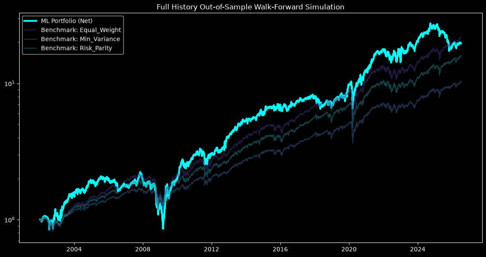
    


```python
# Extra Visualization: Drawdown & Underwater for full_history
roll_max_full_history = period_equity['Net_Value'].cummax()
drawdown_full_history = (period_equity['Net_Value'] - roll_max_full_history) / roll_max_full_history

plt.figure(figsize=(14, 4))
plt.fill_between(drawdown_full_history.index, drawdown_full_history, 0, color='red', alpha=0.3)
plt.title("Portfolio Drawdown: Full History")
plt.ylabel("Drawdown %")
plt.show()

```


    
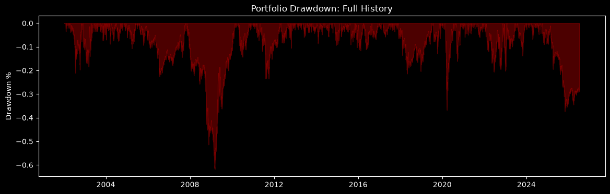
    


### Evaluation Period: Dotcom Gfc


```python
# Load dotcom_gfc outputs
period_equity = pd.read_parquet(PORTFOLIO_DIR / 'dotcom_gfc' / 'portfolio_returns.parquet')
period_bench = pd.read_parquet(PORTFOLIO_DIR / 'dotcom_gfc' / 'benchmark_returns.parquet')
period_perf = pd.read_csv(PORTFOLIO_DIR / 'dotcom_gfc' / 'performance_summary.csv', index_col=0)

display(period_perf)

plt.figure(figsize=(14, 7))
plt.plot(period_equity.index, period_equity['Net_Value'] / period_equity['Net_Value'].iloc[0], label='ML Portfolio (Net)', linewidth=3, color='cyan')
for c in period_bench.columns:
    plt.plot(period_bench.index, period_bench[c], label=f'Benchmark: {c}', alpha=0.5)

plt.title(f"Dotcom Gfc Out-of-Sample Walk-Forward Simulation")
plt.yscale('log')
plt.legend()
plt.show()

```


<div>
<style scoped>
    .dataframe tbody tr th:only-of-type {
        vertical-align: middle;
    }

    .dataframe tbody tr th {
        vertical-align: top;
    }

    .dataframe thead th {
        text-align: right;
    }
</style>
<table border="1" class="dataframe">
  <thead>
    <tr style="text-align: right;">
      <th></th>
      <th>0</th>
    </tr>
  </thead>
  <tbody>
    <tr>
      <th>Gross_CAGR</th>
      <td>0.13504268535549913</td>
    </tr>
    <tr>
      <th>Net_CAGR</th>
      <td>0.12973372129654348</td>
    </tr>
    <tr>
      <th>Cost_Drag_CAGR</th>
      <td>0.005308964058955645</td>
    </tr>
    <tr>
      <th>Annual_Return</th>
      <td>0.12973372129654348</td>
    </tr>
    <tr>
      <th>Annual_Volatility</th>
      <td>0.2630428661585346</td>
    </tr>
    <tr>
      <th>Sharpe_Ratio</th>
      <td>0.5948612231098428</td>
    </tr>
    <tr>
      <th>Sortino_Ratio</th>
      <td>0.8211727168524529</td>
    </tr>
    <tr>
      <th>Max_Drawdown</th>
      <td>-0.6178052567815375</td>
    </tr>
    <tr>
      <th>Calmar_Ratio</th>
      <td>0.2099912875011659</td>
    </tr>
    <tr>
      <th>Information_Ratio</th>
      <td>0.12704188912262734</td>
    </tr>
    <tr>
      <th>Alpha</th>
      <td>0.021109342653985376</td>
    </tr>
    <tr>
      <th>Beta</th>
      <td>1.112948323578552</td>
    </tr>
    <tr>
      <th>Total_Transaction_Costs</th>
      <td>7384539.296046753</td>
    </tr>
    <tr>
      <th>Annual_Turnover</th>
      <td>4.588109505112018</td>
    </tr>
    <tr>
      <th>Average_Rebalance_Turnover</th>
      <td>0.8010984850195587</td>
    </tr>
    <tr>
      <th>Win_Rate</th>
      <td>0.5218929677134011</td>
    </tr>
    <tr>
      <th>Average_Holding_Period</th>
      <td>54.92458271085826</td>
    </tr>
    <tr>
      <th>Evaluation_Period</th>
      <td>dotcom_gfc</td>
    </tr>
  </tbody>
</table>
</div>


    
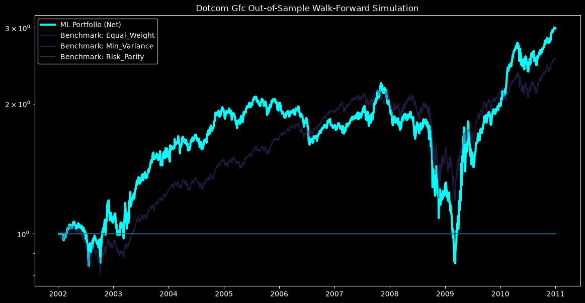
    


```python
# Extra Visualization: Drawdown & Underwater for dotcom_gfc
roll_max_dotcom_gfc = period_equity['Net_Value'].cummax()
drawdown_dotcom_gfc = (period_equity['Net_Value'] - roll_max_dotcom_gfc) / roll_max_dotcom_gfc

plt.figure(figsize=(14, 4))
plt.fill_between(drawdown_dotcom_gfc.index, drawdown_dotcom_gfc, 0, color='red', alpha=0.3)
plt.title("Portfolio Drawdown: Dotcom Gfc")
plt.ylabel("Drawdown %")
plt.show()

```


    
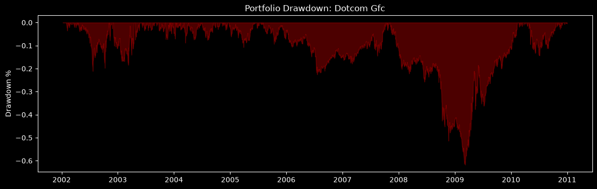
    


### Evaluation Period: Bull Market


```python
# Load bull_market outputs
period_equity = pd.read_parquet(PORTFOLIO_DIR / 'bull_market' / 'portfolio_returns.parquet')
period_bench = pd.read_parquet(PORTFOLIO_DIR / 'bull_market' / 'benchmark_returns.parquet')
period_perf = pd.read_csv(PORTFOLIO_DIR / 'bull_market' / 'performance_summary.csv', index_col=0)

display(period_perf)

plt.figure(figsize=(14, 7))
plt.plot(period_equity.index, period_equity['Net_Value'] / period_equity['Net_Value'].iloc[0], label='ML Portfolio (Net)', linewidth=3, color='cyan')
for c in period_bench.columns:
    plt.plot(period_bench.index, period_bench[c], label=f'Benchmark: {c}', alpha=0.5)

plt.title(f"Bull Market Out-of-Sample Walk-Forward Simulation")
plt.yscale('log')
plt.legend()
plt.show()

```


<div>
<style scoped>
    .dataframe tbody tr th:only-of-type {
        vertical-align: middle;
    }

    .dataframe tbody tr th {
        vertical-align: top;
    }

    .dataframe thead th {
        text-align: right;
    }
</style>
<table border="1" class="dataframe">
  <thead>
    <tr style="text-align: right;">
      <th></th>
      <th>0</th>
    </tr>
  </thead>
  <tbody>
    <tr>
      <th>Gross_CAGR</th>
      <td>0.15582934052337372</td>
    </tr>
    <tr>
      <th>Net_CAGR</th>
      <td>0.15075282859344608</td>
    </tr>
    <tr>
      <th>Cost_Drag_CAGR</th>
      <td>0.005076511929927641</td>
    </tr>
    <tr>
      <th>Annual_Return</th>
      <td>0.15075282859344608</td>
    </tr>
    <tr>
      <th>Annual_Volatility</th>
      <td>0.20230341008076289</td>
    </tr>
    <tr>
      <th>Sharpe_Ratio</th>
      <td>0.796117628833871</td>
    </tr>
    <tr>
      <th>Sortino_Ratio</th>
      <td>0.9857121472578253</td>
    </tr>
    <tr>
      <th>Max_Drawdown</th>
      <td>-0.3677820962936663</td>
    </tr>
    <tr>
      <th>Calmar_Ratio</th>
      <td>0.40989713776897146</td>
    </tr>
    <tr>
      <th>Information_Ratio</th>
      <td>-0.0314418515132866</td>
    </tr>
    <tr>
      <th>Alpha</th>
      <td>0.014440233430352414</td>
    </tr>
    <tr>
      <th>Beta</th>
      <td>0.92303567138782</td>
    </tr>
    <tr>
      <th>Total_Transaction_Costs</th>
      <td>11118393.61903337</td>
    </tr>
    <tr>
      <th>Annual_Turnover</th>
      <td>4.383987118372201</td>
    </tr>
    <tr>
      <th>Average_Rebalance_Turnover</th>
      <td>0.7427666235751385</td>
    </tr>
    <tr>
      <th>Win_Rate</th>
      <td>0.5404624277456648</td>
    </tr>
    <tr>
      <th>Average_Holding_Period</th>
      <td>57.48192072552645</td>
    </tr>
    <tr>
      <th>Evaluation_Period</th>
      <td>bull_market</td>
    </tr>
  </tbody>
</table>
</div>


    
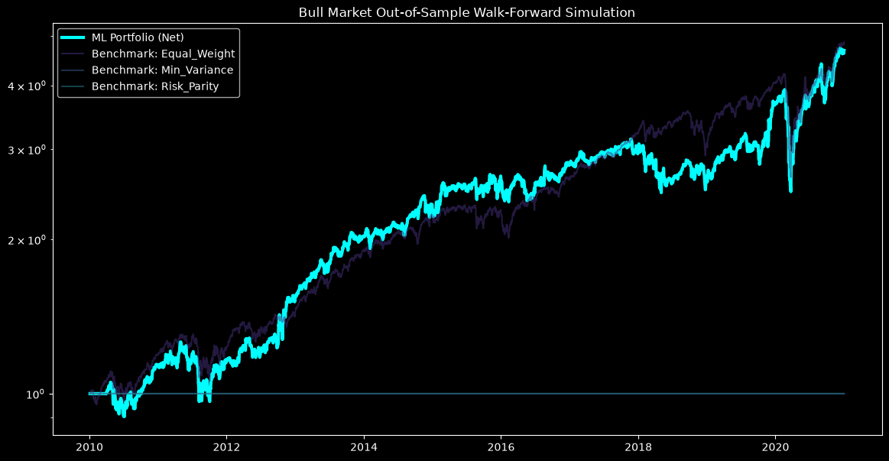
    


```python
# Extra Visualization: Drawdown & Underwater for bull_market
roll_max_bull_market = period_equity['Net_Value'].cummax()
drawdown_bull_market = (period_equity['Net_Value'] - roll_max_bull_market) / roll_max_bull_market

plt.figure(figsize=(14, 4))
plt.fill_between(drawdown_bull_market.index, drawdown_bull_market, 0, color='red', alpha=0.3)
plt.title("Portfolio Drawdown: Bull Market")
plt.ylabel("Drawdown %")
plt.show()

```


    
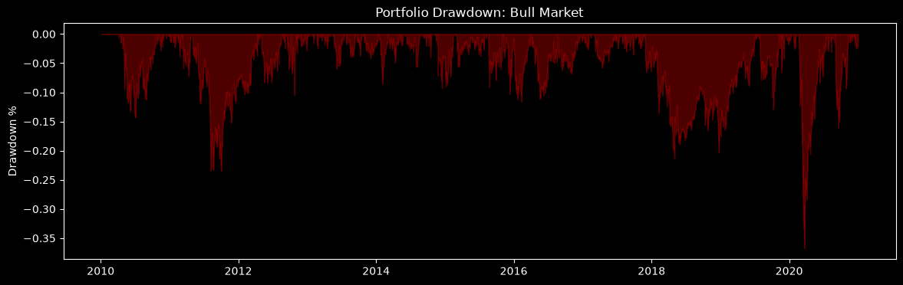
    


### Evaluation Period: Recent Market


```python
# Load recent_market outputs
period_equity = pd.read_parquet(PORTFOLIO_DIR / 'recent_market' / 'portfolio_returns.parquet')
period_bench = pd.read_parquet(PORTFOLIO_DIR / 'recent_market' / 'benchmark_returns.parquet')
period_perf = pd.read_csv(PORTFOLIO_DIR / 'recent_market' / 'performance_summary.csv', index_col=0)

display(period_perf)

plt.figure(figsize=(14, 7))
plt.plot(period_equity.index, period_equity['Net_Value'] / period_equity['Net_Value'].iloc[0], label='ML Portfolio (Net)', linewidth=3, color='cyan')
for c in period_bench.columns:
    plt.plot(period_bench.index, period_bench[c], label=f'Benchmark: {c}', alpha=0.5)

plt.title(f"Recent Market Out-of-Sample Walk-Forward Simulation")
plt.yscale('log')
plt.legend()
plt.show()

```


<div>
<style scoped>
    .dataframe tbody tr th:only-of-type {
        vertical-align: middle;
    }

    .dataframe tbody tr th {
        vertical-align: top;
    }

    .dataframe thead th {
        text-align: right;
    }
</style>
<table border="1" class="dataframe">
  <thead>
    <tr style="text-align: right;">
      <th></th>
      <th>0</th>
    </tr>
  </thead>
  <tbody>
    <tr>
      <th>Gross_CAGR</th>
      <td>-0.027868042190972275</td>
    </tr>
    <tr>
      <th>Net_CAGR</th>
      <td>-0.03207374802712826</td>
    </tr>
    <tr>
      <th>Cost_Drag_CAGR</th>
      <td>0.004205705836155982</td>
    </tr>
    <tr>
      <th>Annual_Return</th>
      <td>-0.03207374802712826</td>
    </tr>
    <tr>
      <th>Annual_Volatility</th>
      <td>0.2015896426414986</td>
    </tr>
    <tr>
      <th>Sharpe_Ratio</th>
      <td>-0.061018629934604565</td>
    </tr>
    <tr>
      <th>Sortino_Ratio</th>
      <td>-0.07783663509763178</td>
    </tr>
    <tr>
      <th>Max_Drawdown</th>
      <td>-0.4138663133198285</td>
    </tr>
    <tr>
      <th>Calmar_Ratio</th>
      <td>-0.07749784651437006</td>
    </tr>
    <tr>
      <th>Information_Ratio</th>
      <td>-1.2607329180362938</td>
    </tr>
    <tr>
      <th>Alpha</th>
      <td>-0.14601160978423247</td>
    </tr>
    <tr>
      <th>Beta</th>
      <td>0.8868123808224483</td>
    </tr>
    <tr>
      <th>Total_Transaction_Costs</th>
      <td>2216227.6098591206</td>
    </tr>
    <tr>
      <th>Annual_Turnover</th>
      <td>4.383563529470528</td>
    </tr>
    <tr>
      <th>Average_Rebalance_Turnover</th>
      <td>0.7578725907282651</td>
    </tr>
    <tr>
      <th>Win_Rate</th>
      <td>0.5061460592913956</td>
    </tr>
    <tr>
      <th>Average_Holding_Period</th>
      <td>57.487475271160946</td>
    </tr>
    <tr>
      <th>Evaluation_Period</th>
      <td>recent_market</td>
    </tr>
  </tbody>
</table>
</div>


    
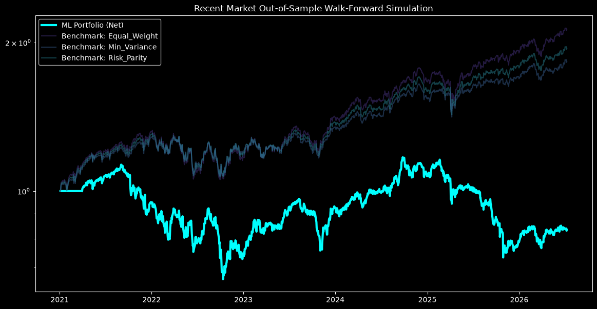
    


```python
# Extra Visualization: Drawdown & Underwater for recent_market
roll_max_recent_market = period_equity['Net_Value'].cummax()
drawdown_recent_market = (period_equity['Net_Value'] - roll_max_recent_market) / roll_max_recent_market

plt.figure(figsize=(14, 4))
plt.fill_between(drawdown_recent_market.index, drawdown_recent_market, 0, color='red', alpha=0.3)
plt.title("Portfolio Drawdown: Recent Market")
plt.ylabel("Drawdown %")
plt.show()

```


    
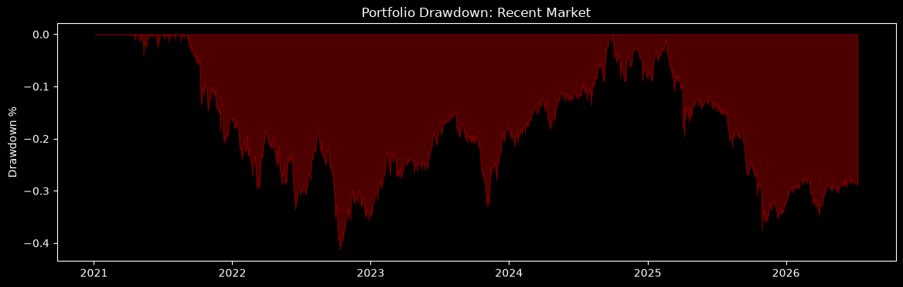
    

